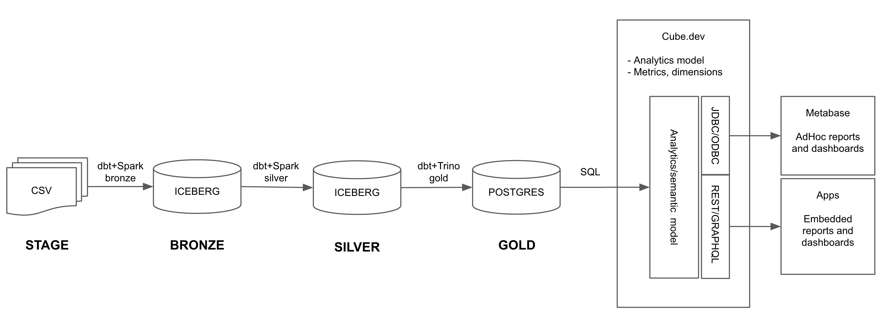
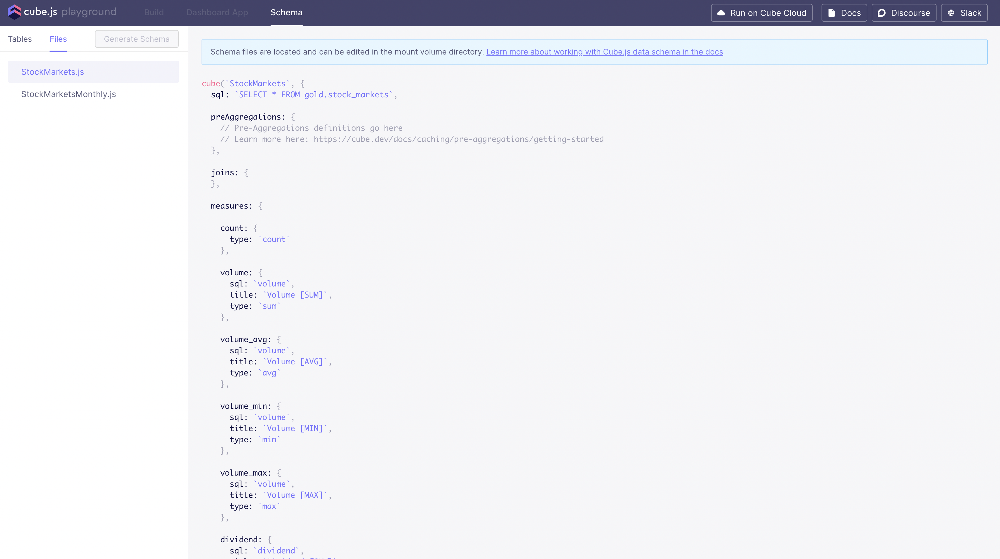
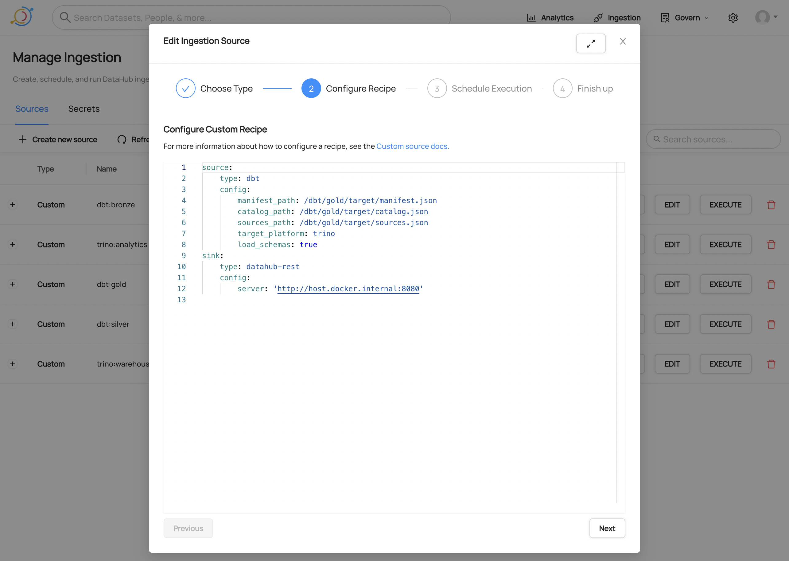
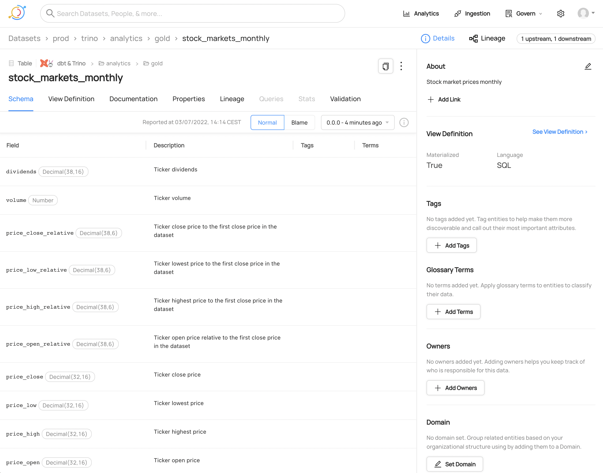

# ngods 
ngods stands for New Generation Opensource Data Stack. It includes the following components: 

- [Minio](https://min.io) for local S3 storage 
- [Apache Iceberg](https://iceberg.apache.org) as a data storage format 
- [Apache Spark](https://spark.apache.org) for data transformation 
- [Trino](https://trino.io/) for federated data query 
- [dbt](https://www.getdbt.com/) for ELT 
- [Dagster](https://dagster.io/) for data orchetsration 
- [DataHub](https://datahubproject.io/) as a data catalog and governance layer
- [Cube.dev](https://cube.dev/) for data analysis and semantic data model 
- [Metabase](https://www.metabase.com/) for self-service data visualization (dashboards) 

ngods data pipeline is inspired by [Databrick’s medallion architecture](https://databricks.com/fr/glossary/medallion-architecture) that uses bronze, silver, and gold data stages. 

ngods is open-sourced under a [BSD license](https://github.com/zsvoboda/ngods-uk/blob/main/LICENSE) and it is distributed as a docker-compose script that supports Intel and ARM architectures.

## ngods installation and hardware requirements
ngods requires a machine with at least 16GB RAM and Intel or Arm 64 CPU running [Docker](https://www.docker.com/). It requires `docker-compose` tool to be installed.

1. Clone the [ngods repo](https://github.com/zsvoboda/ngods-uk)

```bash
git clone https://github.com/zsvoboda/ngods-uk.git
cd ngods-uk
```

2. Select `docker-compose` script for your CPU architecture 

```bash
cd ngods-uk

# use the docker-compose.x86.yml for Intel CPU 
cp docker-compose.x86.yml docker-compose.yml

# use the docker-compose.arm64.yml for ARM (e.g. Apple M1/M2)
cp docker-compose.arm64.yml docker-compose.yml
```

3. Start it using the `docker-compose up` command

```bash
cd ngods-uk

docker-compose up -d
```

This can take quite long depending on your network speed.

4. Stop it using the `docker-compose down` command

```bash
cd ngods-uk

docker-compose down
```

## Directories
Here are few distribution's directories that you'll need:

- `conf` configuration of all data stack components
    - `cube` Cube.dev schema (semantic model definition)
    - `trino` Trino config files and catalogs definitions
    - `spark` Spark configuration
- `data` main data directory 
    - `minio` root data directory (contains buckets and file data)
    - `spark` Jupyter notebooks
    - `stage` file stage data. Spark can access this directory via `/home/data/stage/` path. 
- `projects` dbt, Dagster, and DataHub projects
    - `dagster` Dagster orchestration project
    - `datahub` DataHub catalog crawling recipes 
    - `dbt` dbt transformations (one project per each medallion stage: `bronze`, `silver`, and `gold`) 

## Endpoints
The data stack has the following endpoints

- Spark
    - http://localhost:8088 - Jupyter notebooks 
    - `jdbc:hive2://localhost:10000` JDBC URL (no username / password)
    - localhost:7077 - Spark API endpoint
    - http://localhost:8061 - Spark master node monitoring page 
    - http://localhost:8062 - Spark slave node monitoring page 
    - http://localhost:18080 - Spark history server page 
- Trino
    - `jdbc:trino://localhost:8060` JDBC URL (username `trino` / no password)
- Dagster
    - http://localhost:3070 - Dagster orchestration UI
- DataHub
    - http://localhost:9002 - DataHub catalog UI
- Postgres
    - `jdbc:postgresql://localhost:5432/postgres` JDBC URL (username `postgres` / password `postgres`)
- Minio
    - http://localhost:9001 - Minio UI (username `minio` / password `minio123`)
- Cube.dev
    - http://localhost:4000 - Cube.dev development UI 
    - `jdbc:postgresql://localhost:3245/cube` JDBC URL (username `cube` / password `cube`)
- Metabase
    - http://localhost:3030 (username `metabase@ngods.com` / password `metabase1`)

Spark and Trino database engines share the `warehouse.bronze` and `warehouse.silver` schemas with Iceberg tables. 

## Data pipeline
The project's data pipeline is designed as [Databrick’s medallion architecture](https://databricks.com/fr/glossary/medallion-architecture)


and consists of the following phases:

1. Data are downloaded from Yahoo Finance REST API to the local Minio bucket ([./data/stage](./data/stage)) using Dagster job.
2. The downloaded CSV file is loaded to the bronze stage Iceberg tables (warehouse.bronze Spark schema) using dbt models that are executed in Spark ([./projects/dbt/bronze](./projects/dbt/bronze)).
3. Silver stage Iceberg tables (warehouse.silver Spark schema) are created using dbt models that are executed in Spark ([./projects/dbt/silver](./projects/dbt/silver)). 
5. Gold stage Postgres tables (analytics.gold Trino schema) are created using dbt models that are executed in Trino ([./projects/dbt/gold](./projects/dbt/gold)).

All data pipeline phases are orchestrated by [Dagster](https://www.dagster.io/) framework. Dagster operations, resources and jobs are defined in the [Dagster project](./projects/dagster/). 


The pipeline is executed by running the e2e job from the Dagster console at http://localhost:3070/ using [this yaml config file](./projects/dagster/e2e.yaml)

All tables and their dependencies are registered in DataHub catalog that is available at http://localhost:9002/. DataHub crawling recipes are defined in the [DataHub project](./projects/datahub/).

### dbt models
There are three dbt models. One for each medaillon stage: `bronze`, `silver`, and `gold`.


The dbt models are defined in the [dbt project](./projects/dbt/).

## Databases: Spark, Trino, and Postgres
ngods stack includes three database engines: Spark, Trino, and Postgres. Both Spark and Trino have access to Iceberg tables in `warehouse.bronze` and `warehouse.silver` schemas. Trino engine can also access the `analytics.gold` schema in Postgres. Trino can federate queries between the Postgres and Iceberg tables. 

The Spark engine is configured for ELT and pyspark data transformations. 


The Trino engine is configured for data federation between the Iceberg and Postgres tables. Additional catalogs can be [configured](./conf/trino/catalog) as needed. 


The Postgres database has accesses only to the `analytics.gold` schema and it is used for executing analytical queries over the gold data.

## Analytics
ngods includes [Cube.dev](https://cube.dev/) for [semantic data model](./conf/cube/schema) and [Metabase](https://www.metabase.com/) for self-service analytics (dashboards, reports, and visualizations).



Analytical (semantic) model is defined in [Cube.dev](https://cube.dev/) and is used for executing analytical queries over the gold data.



[Metabase](https://www.metabase.com/) is connected to the [Cube.dev](https://cube.dev/) via [SQL API](https://cube.dev/docs/backend/sql). End users can use it for self-service creation of dashboards, reports, and data visualizations. [Metabase](https://www.metabase.com/) is also directly connected to the gold schema in the Postgres database.


## Data catalog and governance
ngods uses [DataHub](https://www.datahub.io/) as data catalog and for governance purposes. DataHub crawls all the data from the data stack and stores it in the catalog. 



DataHub catalog contains all database tables, their schemas, and dependencies.  




DataHub crawling recipes are stored in the [DataHub project directory](./projects/datahub/).

